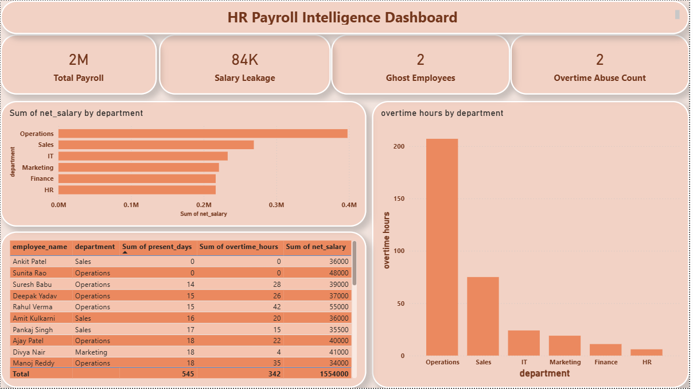

# 📊 ZENVY – HR Intelligence & Payroll Analytics Dashboard

## 📌 Project Overview
This project focuses on designing an **HR Intelligence Dashboard** for **ZENVY (AI-powered Payroll)** to analyze payroll data, detect payroll risks, and provide **executive-level insights**.  
The goal is to move beyond basic payroll reporting and enable **data-driven payroll governance**.

---

## 🎯 Business Problem
Payroll systems are highly sensitive and prone to risks such as:
- Salary leakage due to missing attendance
- Payments to ghost or exited employees
- Excessive and unjustified overtime
- Lack of visibility into department-level payroll risks

These issues can lead to **financial loss, compliance risks, and poor decision-making**.

---

## 🛠 Tools & Technologies
- **MySQL (SQL)** – Data preparation and business logic  
- **Power BI** – Dashboard creation and visualization  
- **CSV** – Data storage and transfer  

---

## 🗂 Data Structure
The analysis is based on **three core datasets**:
- **Employees** – Employee master data (department, designation, status, salary)
- **Attendance** – Monthly attendance and overtime records
- **Payroll** – Salary, overtime pay, and final payroll transactions

A consolidated SQL view called **`payroll_analysis`** was created as a **single source of truth**.

---

## 📊 Key KPIs (15+ Defined)
Some of the key payroll KPIs include:
- Total Payroll Cost  
- Average Payroll per Employee  
- Payroll by Department  
- Salary Leakage Amount & Percentage  
- Ghost Employee Count & Cost  
- Overtime Abuse Count  
- Total Overtime Hours & Cost  
- Attendance Compliance Rate  
- Missing Attendance Count  
- Payroll Exception Rate  
- High-Risk Department Index  

*(Detailed KPI definitions are documented separately.)*

---

## 🚨 Payroll Risk Detection
The dashboard detects and highlights:
- **Salary Leakage** – Salary paid without valid attendance or to exited employees  
- **Ghost Employees** – Employees paid without active status or attendance  
- **Overtime Abuse** – Overtime exceeding defined thresholds  
- **Missing Attendance** – Zero or incomplete attendance records  

---

## 📈 Dashboard Design
The Power BI dashboard is a **single-page executive view** with **three visuals**:

1. **Payroll Health Summary (KPI Cards)**  
   - Total Payroll  
   - Salary Leakage  
   - Ghost Employees  
   - Overtime Abuse Count  

2. **Payroll & Overtime by Department**  
   - Department-wise payroll cost  
   - Department-wise overtime hours  

3. **Payroll Risk Table**  
   - Employees flagged for payroll exceptions  

This layout ensures **clarity, focus, and executive usability**.

## 🖥 Dashboard Preview

---

## 🧠 Executive Insights
- Payroll costs are concentrated in a few departments, increasing financial exposure.
- Salary leakage exists due to weak attendance and exit validation.
- Overtime abuse is concentrated in specific departments, indicating inefficiencies.
- Certain departments consistently appear as high-risk payroll zones.

These insights help leadership move from **reactive reporting** to **proactive payroll governance**.

---

## ✅ Recommendations
- Enforce **attendance-linked payroll processing**
- Automate **exit-status validation** before salary release
- Introduce **overtime thresholds and approvals**
- Conduct **department-level payroll audits**
- Maintain a **single source of truth** for payroll analytics

---

## 📌 Deliverables
- Cleaned payroll analysis dataset  
- KPI definitions document  
- Power BI dashboard  
- Executive insight report  

---

## 🏁 Conclusion
This project demonstrates how payroll data can be transformed into **HR intelligence** by combining SQL-based validation with executive-focused visualization. The solution improves cost control, compliance, and decision-making.

---

### 🎤 One-Line Summary
> Built an HR Payroll Intelligence Dashboard to detect payroll risks, control costs, and deliver executive-level insights.

